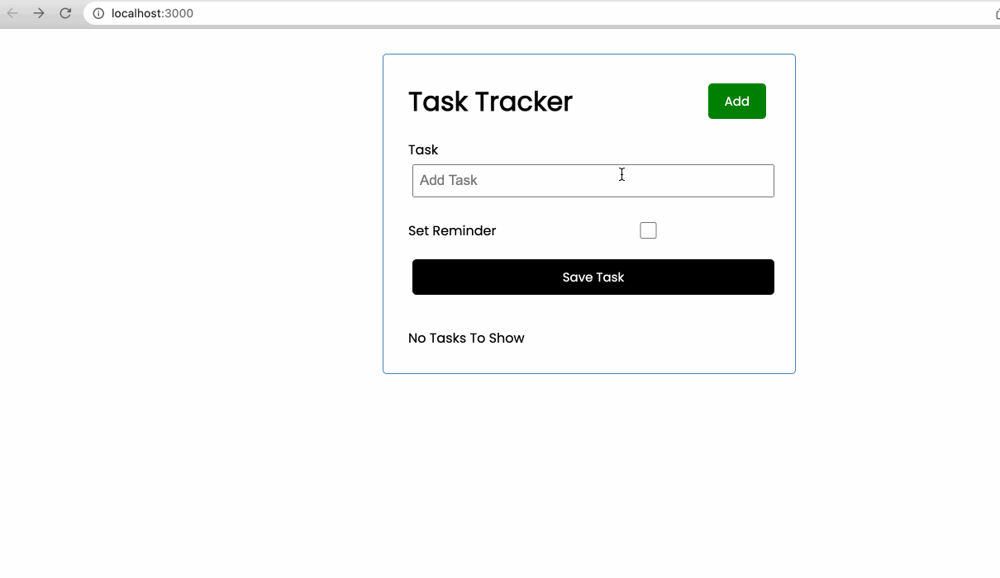

# H4I Impact Team Challenge - *Simple Todo*

GitHub page: https://aaron-ang.github.io/react-todo-app

**NOTE**

* Functionality in GitHub page will **NOT** work as I am using a locally-hosted backend
* Refer to walkthrough below for expected behavior

## Tech Stack
* Frontend: React
* Backend: Flask, MongoDB

## User Stories

The following **required** functionality is completed:

* [x] Form/input for user to add items to their to-do list
* [x] Ability to remove an item on the list after adding
* [x] Items should persist on the page after a refresh

The following **additional** features are implemented:

* [x] Double-click task to set a reminder (i.e. add a green tag over the task tab)

## Video Walkthrough

Here's a walkthrough of implemented user stories:

GIF created with [LiceCap](http://www.cockos.com/licecap/).

## Notes

I attempted to integrate the frontend and backend by calling setState locally, then use API calls to change the backend data. I am not sure if this is the best way, or if there are other methods to update the state after an API call is made. (I was unfortunately unable to find an efficient solution online)
